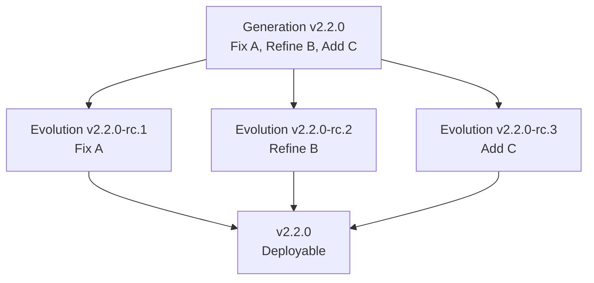

# **gryt-ci** – *Composable, Contract-Driven CI for Secure Evolvability*

> **Move fast — and stay in control.**
> gryt-ci is a **local-first, platform-agnostic CI framework** that turns raw AI velocity into **governed, auditable, and resilient releases**.
> Built on **atomic contracts** (Generations) and **iterative proof** (Evolutions), gryt-ci ensures **nothing ships until the declared intent is 100% realized** — while preserving maximum execution speed.

---

## Table of Contents
- [Core Primitives](#core-primitives)
- [Release Model: Generation & Evolution](#release-model-generation--evolution)
- [Why Contract-Based Releases?](#why-contract-based-releases)
- [Secure Evolvability (NIST 800-161)](#secure-evolvability-nist-800-161)
- [CLI & Workflow](#cli--workflow)
- [Database & Audit Trail](#database--audit-trail)
- [Catalog System](#catalog-system)
- [Installation](#installation)
- [Quick Start](#quick-start)
- [Examples](#examples)
- [Contributing](#contributing)

---

## Core Primitives

| Primitive | Definition | Role | Composition |
|---------|------------|------|-------------|
| **Step** | Atomic executable action (`go test`, `echo "hello"`). | Smallest **executable** unit. | → **Pipeline** |
| **Pipeline** | Ordered or parallel set of **Steps** + **Runners** + config. | **Unit of execution**. | → **Runtime**, references **Data**, **Hooks**, **Destinations**, **Versioning** |
| **Data** | Immutable artifact/log row in `.gryt/gryt.db` (SQLite). | **Storage & proof**. | Produced by **Steps**, consumed by **Hooks** |
| **Runtime** | Local execution sandbox (Python-based, no containers). | **Host environment**. | Executes **Runners** |
| **Runner** | Scheduler driving **Steps** (sequential/parallel). | **Orchestrator**. | Inside **Pipeline** |
| **Versioning** | SemVer + Git-tag mapping. | **Release tracking**. | Applied to **Generations/Evolutions** |
| **Hooks** | Event callbacks (`pipeline_start`, `step_fail`). | **Observability & policy**. | Attached to **Pipeline** |
| **Destinations** | External sinks (S3, Slack, Prometheus). | **Export**. | Receive **Data** |

---

## Release Model: Generation & Evolution

| Term | Definition | Relationship |
|------|-----------|--------------|
| **Generation** | **Release Contract** – declarative blueprint of *what* `vX.Y.Z` **must** contain (Fix/Refine/Add/Remove). | 1 Generation → N Evolutions |
| **Evolution** | **Point-in-time proof** – a tagged pipeline run (`vX.Y.Z-rc.12`) that realizes one or more declared changes. | 1 Evolution = 1 Pipeline run + 1 Version tag |
| **Change Type** | One of: **Fix**, **Refine**, **Add**, **Remove** | Defined in Generation → proven in Evolutions |



### Generation File (`.gryt/generations/v2.2.0.yaml`)
```yaml
version: v2.2.0
description: "Payment gateway overhaul"
changes:
  - type: fix
    id: PAY-001
    title: "Race condition in refund webhook"
  - type: refine
    id: PAY-002
    title: "Reduce latency of status polling"
  - type: add
    id: PAY-003
    title: "Support Apple Pay"
pipeline_template: release-pipeline
```

---

## Why Contract-Based Releases?

| Goal | Push-Every-Commit | gryt-ci |
|------|-------------------|--------|
| **Velocity** | Immediate deploy | Same speed + **parallel Runners** |
| **Atomicity** | Partial changes leak | **Generation** = complete contract |
| **Secure Evolvability** | Drift, tech debt | **Explicit intent + proof** |
| **Guardrails** | None | **Hooks**, **DB**, **policy checks** |
| **Emergency Fixes** | Bypass CI | **Hot-fix Generation** (`v2.2.1`) |

> **Even a single-line bug fix is a Generation.**
> `v2.2.1` → alpha → beta → RC → prod.
> Speed is preserved. **Control is never sacrificed.**

---

## Secure Evolvability (NIST 800-161)

> **“A system must be able to evolve securely.”**

gryt-ci **enforces** this by:

- **Declarative intent** (Generation)
- **Immutable proof** (Data rows per Evolution)
- **Audit trail** (SQLite DB)
- **Policy gates** (Hooks fail on violation)
- **Promotion gate** (100% PASS required)

**Result:** Velocity **without** long-term degradation.

---

## CLI & Workflow

```bash
# Initialize project
gryt init

# Create a release contract
gryt generation new v2.2.0

# Start an evolution (proves one or more changes)
gryt evolution start v2.2.0 --change PAY-001

# List progress
gryt evolution list v2.2.0

# Promote when complete
gryt generation promote v2.2.0   # → tags v2.2.0, marks deployable
```

---

## Database & Audit Trail

```sql
-- .gryt/gryt.db
TABLE generations (version, status, created_at)
TABLE generation_changes (generation_id, change_id, type, title)
TABLE evolutions (tag, generation_id, change_id, status, pipeline_run)
TABLE pipeline_runs (id, pipeline_name, status, started_at)
TABLE data_rows (evolution_id, step_name, metric, value, artifact_path)
```

Query examples:
```bash
gryt db query "SELECT * FROM evolutions WHERE generation_id = 'v2.2.0'"
gryt db metric pass_rate --gen v2.2.0
```

---

## Catalog System

Reusable components defined in **language-specific catalogs**:

```python
# examples/language_go.py
steps = {
    "test": {"cmd": "go test ./..."},
    "lint": {"cmd": "golint ./..."},
    "build": {"cmd": "go build -o bin/app"}
}

pipelines = {
    "release": {
        "steps": ["lint", "test", "build"],
        "runners": 3
    }
}
```

Use across projects:
```bash
gryt pipeline new myapp --from catalog:go.release
```

---

## Installation

```bash
pip install gryt-ci
```

> Requires Python 3.9+, Git, and SQLite.

---

## Quick Start

```bash
# 1. Initialize
gryt init

# 2. Define release contract
cat > .gryt/generations/v1.0.0.yaml <<EOF
version: v1.0.0
changes:
  - type: add
    id: FEAT-001
    title: "User login"
pipeline_template: go.release
EOF

# 3. Run evolution
gryt evolution start v1.0.0 --change FEAT-001

# 4. Promote when ready
gryt generation promote v1.0.0
```

---

## Examples

- `examples/language_go.py` – Go CI catalog
- `examples/language_python.py` – Python testing
- `examples/release_gen.py` – Full Generation workflow

---

## Contributing

1. Fork & clone
2. `pip install -e .[dev]`
3. Open PR with `CONTRIBUTING.md` standards

---

**gryt-ci** — *Because speed without control is just noise.*

---

---

# **gryt-ci Roadmap** – *From Current State to Full Contract-Driven CI*

> **Current Version (v0.1.0)**: Basic pipeline execution, SQLite logging, catalog system.
> **Target Vision**: Full **Generation/Evolution** contract engine with **secure evolvability**.

---

## Current State (Implemented)

| Feature | Status |
|-------|--------|
| `gryt init`, `gryt run` | Done |
| Step & Pipeline execution | Done |
| Local Runtime (no Docker) | Done |
| Parallel Runners | Done |
| SQLite DB (`.gryt/gryt.db`) | Done |
| `gryt db query` | Done |
| Language catalogs (`examples/language_*.py`) | Done |
| Hooks (basic) | Done |
| Version tagging (manual) | Done |

---

## Roadmap: Gaps & Milestones

| Milestone | Features | Target |
|---------|----------|--------|
| **v0.2.0** – *Contract Foundations* | `gryt generation new/edit/list`<br>`.gryt/generations/*.yaml`<br>DB: `generations`, `generation_changes` tables | Q4 2025 |
| **v0.3.0** – *Evolution Engine* | `gryt evolution start --change ID`<br>Auto RC tagging (`vX.Y.Z-rc.N`)<br>DB: `evolutions` table<br>Link Evolution → Pipeline run | Q1 2026 |
| **v0.4.0** – *Promotion Gates* | `gryt generation promote` → 100% PASS required<br>Fail if any Change lacks PASS Evolution<br>Auto Git tag on promote | Q1 2026 |
| **v0.5.0** – *Policy & Hooks++* | Hook: `on_change_type`<br>Policy: `require_e2e_for_add`<br>Destinations: Slack/Prometheus alerts | Q2 2026 |
| **v0.6.0** – *Templates & UX* | `gryt new --template go-release`<br>`gryt dashboard` (TUI)<br>Web UI (optional) | Q2 2026 |
| **v1.0.0** – *Secure Evolvability Certified* | NIST 800-161 audit report<br>Full audit trail export<br>Rollback via DB<br>Hot-fix Generation workflow | Q3 2026 |

---

## Gap Analysis

| Required for Vision | Current | Gap |
|---------------------|---------|-----|
| **Generation contract** | None | Add CLI + YAML + DB |
| **Evolution tagging** | Manual Git tag | Auto-increment RC |
| **Change Types** | None | Add to YAML + DB |
| **Promotion gate** | None | 100% PASS logic |
| **Policy hooks** | Basic | Add `on_change_type`, `require_*` |
| **Hot-fix path** | Same as normal | Documented mini-Generation |
| **Audit export** | Raw DB | CSV/JSON/export CLI |

---

## Next Steps (Immediate)

1. **Merge `CONCEPTS.md` and `PHILOSOPHY.md`** into main README
2. **Create `gryt generation` CLI stub**
3. **Add `generations/` folder + YAML schema**
4. **Extend DB schema** (see below)
5. **Tag v0.2.0** on completion

---

**We are building the CI system that AI-era teams need: fast, local, and unbreakable.**

Let’s ship the contract.
